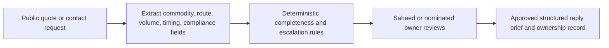

# BV Integrated Workflow Opportunity Snapshot

`INTERNAL TEST DRAFT | DO NOT RELEASE`

Public-evidence diagnostic | 2026-08-11 | Prepared for Saheed Salami, COO and co-founder

## Verified evidence

| Signal | URL and date | What it establishes | What it does not establish |
|---|---|---|---|
| The owned site names UK registration, Nigeria operating roots, international commodity sourcing, two company email routes, and co-founders Azeez Iyanda and Saheed Salami. | https://bvintegrated.co.uk/about-us/ observed 2026-08-09 | Public positioning, accountable founders, and two visible enquiry destinations. | Enquiry volume, internal ownership, response time, qualification rules, or current systems. |
| The contact page provides a request form, `enquiries@bvintegrated.co.uk`, phone, and address. | https://bvintegrated.co.uk/contact-us/ observed 2026-08-09 | A structured buyer trigger and a public business destination exist. | Who reads submissions or how they are routed. |
| Companies House lists Azeez Obasanjo Iyanda and Saheed Olawale Salami as active directors. | https://find-and-update.company-information.service.gov.uk/company/16768029/officers observed 2026-08-09 | Both named founders have current legal accountability. | Which director owns the enquiry process. |

## Workflow hypothesis

When an international commodity buyer submits a quote or contact request, the responsible founder may need to identify the commodity, origin or destination, volume, timing, compliance needs, and next owner. A bounded workflow could extract those fields, flag missing information, and prepare a review queue while Saheed Salami or another nominated human retains approval.

Assumed current-state steps, all hypotheses: enquiry arrives; someone reads free text; missing facts are requested; the enquiry is assigned; a response is drafted.

## Candidate test

| Repetition | Information burden | Handoff | Error/rework | Human review | Evidence |
|---|---|---|---|---|---|
| partial | yes | yes | partial | yes | yes |

Score: `5/6`. Human review and public-evidence gates pass. Volume and internal process remain unknown.

## Illustrative future state

> Illustrative future state. Not connected to company systems.

## Three actions

1. **Validate:** Hold a 30-minute interview with the process owner and one person who handles buyer enquiries.
2. **Measure:** Review 10 to 20 historical enquiries or one week of volume, wait, rework, error, and exception evidence.
3. **Pilot:** Test synthetic or approved historical cases with defined acceptance categories, human approval, no production write, and a rollback path.

Pilot acceptance categories: extraction completeness, classification accuracy, false and missed escalation, routing correctness, draft quality, reviewer effort, and exception handling. Numeric thresholds require baseline and risk evidence.

## Assumptions, failure modes, and exclusions

- Assumption: commodity enquiries recur and need consistent qualification.
- Failure mode: incomplete or ambiguous buyer text may create an incorrect summary or route.
- Exclusion: no autonomous pricing, compliance decision, supplier selection, dispatch, commitment, or message sending.

## Scope boundary

> This public scan identifies one workflow worth testing. A paid diagnostic validates the real process, data, risk, economics, architecture, and implementation path.

`office@bridgeworks.agency · bridgeworks.agency`
